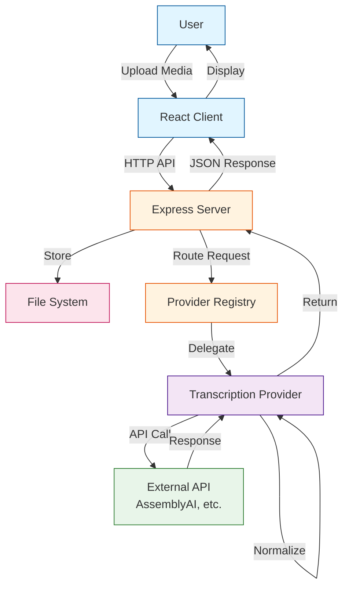
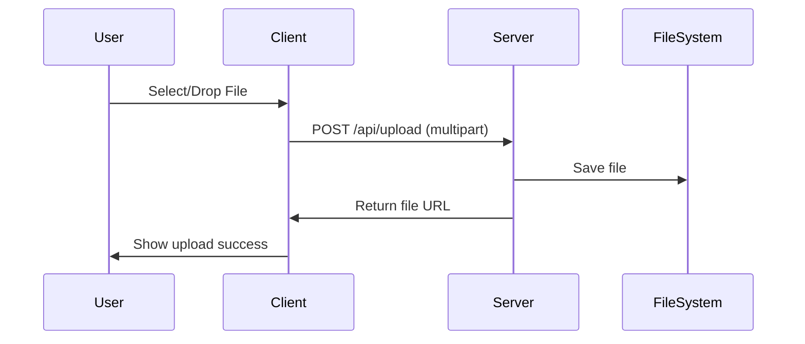
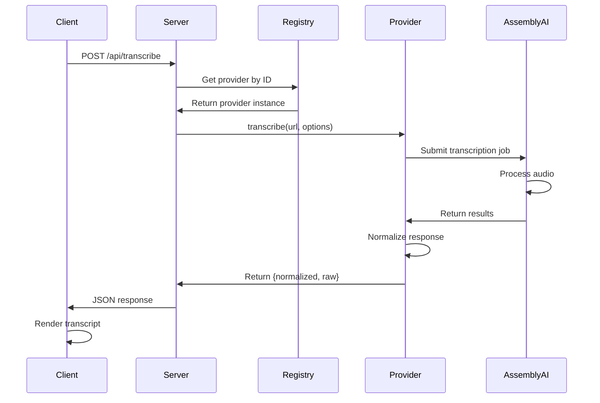
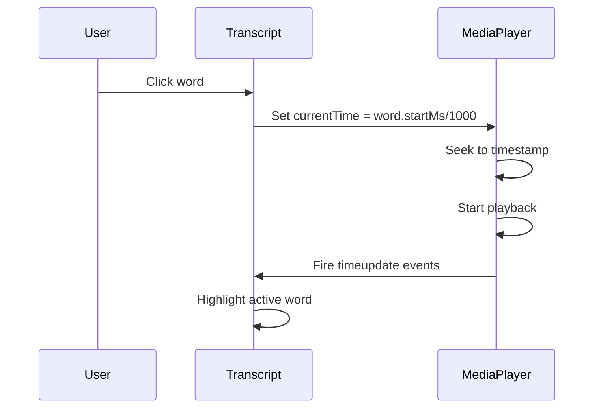

# Architecture Overview

## System Design

The Voice Transcription POC follows a clean, provider-agnostic architecture that separates concerns and enables easy extensibility.

## High-Level Architecture



## Component Breakdown

### Client Layer

**Technology:** React + TypeScript + Vite

**Components:**
- `FileUpload` - Handles drag-and-drop and file selection
- `MediaPlayer` - Renders audio/video with controls
- `TranscriptViewer` - Displays interactive transcript with word-level seeking
- `App` - Main orchestration component

**Responsibilities:**
- User interface and interactions
- File upload management
- Media playback control
- Transcript visualization
- API communication

**Data Flow:**
1. User uploads file
2. File sent to server via FormData
3. Server returns file URL
4. User triggers transcription
5. Client receives normalized + raw transcript
6. Transcript rendered with clickable words

### Server Layer

**Technology:** Express + TypeScript + Node.js

**Structure:**
```
server/
├── src/
│   ├── index.ts           # Server entry, routes, middleware
│   ├── providers/         # Provider implementations
│   │   ├── assemblyai.ts  # AssemblyAI provider
│   │   └── registry.ts    # Provider registry
│   └── types/             # Shared types
│       └── transcription.ts
```

**API Endpoints:**
- `GET /api/providers` - List available providers
- `POST /api/upload` - Upload media file
- `POST /api/transcribe` - Start transcription
- `GET /uploads/:filename` - Serve uploaded files

**Responsibilities:**
- File upload handling
- Provider abstraction
- API request/response management
- Data normalization
- Static file serving

### Provider Abstraction Layer

**Pattern:** Strategy Pattern

**Interface:**
```typescript
interface TranscriptionProvider {
  id: string;
  displayName: string;
  transcribe(mediaUrl: string, options): Promise<ProviderResult>;
}
```

**Benefits:**
- Provider-agnostic client code
- Easy to add new providers
- Consistent data format
- Raw data preservation
- Testable in isolation

**Current Providers:**
- ✅ AssemblyAI
- 🔄 Google Medical STT (architecture ready)

### Normalization Layer

**Purpose:** Convert provider-specific responses to common schema

**Normalized Schema:**
```typescript
interface Transcript {
  durationMs: number;        // Total duration
  speakers?: Speaker[];      // Optional speaker info
  words: TranscriptWord[];   // Word-level timestamps
  segments?: TranscriptSegment[];  // Optional segments
}

interface TranscriptWord {
  text: string;              // Word text
  startMs: number;           // Start timestamp (ms)
  endMs: number;             // End timestamp (ms)
  speakerId?: string;        // Optional speaker ID
  confidence?: number;       // 0.0-1.0 confidence
}
```

**Transformation Process:**
1. Provider returns response
2. Provider normalizes to common schema
3. Both normalized + raw returned
4. Client uses normalized, can inspect raw

## Data Flow

### Upload Flow



### Transcription Flow



### Seeking Flow



## Key Design Decisions

### 1. Provider Abstraction
**Decision:** Use interface + registry pattern

**Rationale:**
- Easy to add providers without changing client
- Testable in isolation
- Clear separation of concerns

**Trade-offs:**
- Additional abstraction layer
- Slight complexity increase
- Worth it for extensibility

### 2. Normalization Layer
**Decision:** Convert all responses to common schema

**Rationale:**
- UI remains provider-agnostic
- Consistent developer experience
- Easy to switch providers

**Trade-offs:**
- Must map all provider features
- Some provider-specific features may be lost
- Worth it for flexibility

### 3. Raw Data Preservation
**Decision:** Return both normalized AND raw data

**Rationale:**
- Debug capability
- Access to provider-specific features
- Transparency
- Future-proofing

**Trade-offs:**
- Larger response payload
- Additional data transfer
- Worth it for debugging and flexibility

### 4. Client-Side Seeking
**Decision:** Implement seeking in client using HTML5 media APIs

**Rationale:**
- No server processing needed
- Instant response
- Leverages browser capabilities
- Simple implementation

**Trade-offs:**
- Relies on browser support
- Limited to HTML5 formats
- Perfect for POC

### 5. Monorepo Structure
**Decision:** Use npm workspaces for client + server

**Rationale:**
- Single repository
- Shared dependencies
- Easy development workflow
- Clear boundaries

**Trade-offs:**
- Slightly more complex setup
- Shared package.json management
- Worth it for development experience

## Security Considerations

### Current State (POC)
⚠️ **Not production ready**

**Missing:**
- Authentication/authorization
- Rate limiting
- Input sanitization
- Request validation
- HTTPS enforcement
- CORS restrictions
- API key protection
- Audit logging

### Production Recommendations

1. **Authentication**
   - JWT or session-based auth
   - Protect all API endpoints
   - User-specific file storage

2. **Rate Limiting**
   - Per-user request limits
   - Per-IP upload limits
   - Provider API quota management

3. **Input Validation**
   - File type verification
   - File size limits
   - Filename sanitization
   - Content-type checking

4. **API Key Security**
   - Server-side only
   - Environment variables
   - Secret management service
   - Rotation policy

5. **Network Security**
   - HTTPS only
   - Strict CORS policy
   - CSP headers
   - Request signing

## Performance Considerations

### Current Limitations
- Single-server architecture
- Synchronous file processing
- No caching
- No CDN

### Scaling Recommendations

1. **File Storage**
   - Use S3/GCS for uploads
   - CDN for serving files
   - Signed URLs for security

2. **Transcription Processing**
   - Queue-based architecture
   - Background job processing
   - Webhooks for completion
   - Progress polling

3. **Caching**
   - Cache provider responses
   - Cache normalized transcripts
   - Redis for session data

4. **Load Balancing**
   - Multiple server instances
   - Load balancer (nginx/ALB)
   - Sticky sessions if needed

## Testing Strategy

### Current State
- No automated tests (POC)

### Recommended Testing

**Unit Tests:**
- Provider normalization logic
- Utility functions
- Component logic

**Integration Tests:**
- API endpoint testing
- Provider integration
- File upload/download

**E2E Tests:**
- Full user workflow
- Upload → Transcribe → Navigate
- Multiple providers

**Performance Tests:**
- Large file handling
- Concurrent requests
- Memory usage

## Future Enhancements

### Phase 1: Core Improvements
- [ ] Add Google Medical STT provider
- [ ] Implement error handling
- [ ] Add loading states
- [ ] Improve mobile UI

### Phase 2: Advanced Features
- [ ] Speaker diarization visualization
- [ ] Word-level editing
- [ ] Export to SRT/VTT
- [ ] Batch processing

### Phase 3: Production Ready
- [ ] Authentication
- [ ] Rate limiting
- [ ] Caching layer
- [ ] Queue-based processing
- [ ] Monitoring & logging

### Phase 4: HIPAA Compliance
- [ ] BAA with providers
- [ ] Audit logging
- [ ] Encryption at rest
- [ ] Access controls
- [ ] Compliance documentation

## Technology Choices

### Why These Technologies?

**TypeScript:**
- Type safety
- Better IDE support
- Catch errors early
- Self-documenting code

**React:**
- Component-based architecture
- Large ecosystem
- Easy to learn
- Great developer experience

**Express:**
- Simple and flexible
- Large middleware ecosystem
- Well-documented
- Production-proven

**Vite:**
- Fast development builds
- Modern bundling
- Hot module replacement
- Great TypeScript support

**AssemblyAI:**
- Word-level timestamps
- Good accuracy
- Simple API
- Generous free tier

## Conclusion

This architecture provides:
- ✅ Provider flexibility
- ✅ Clean separation of concerns
- ✅ Easy extensibility
- ✅ Transparent data flow
- ✅ Type safety
- ✅ Developer-friendly

While suitable for POC and demo purposes, production deployment requires additional security, scalability, and reliability features as outlined above.
