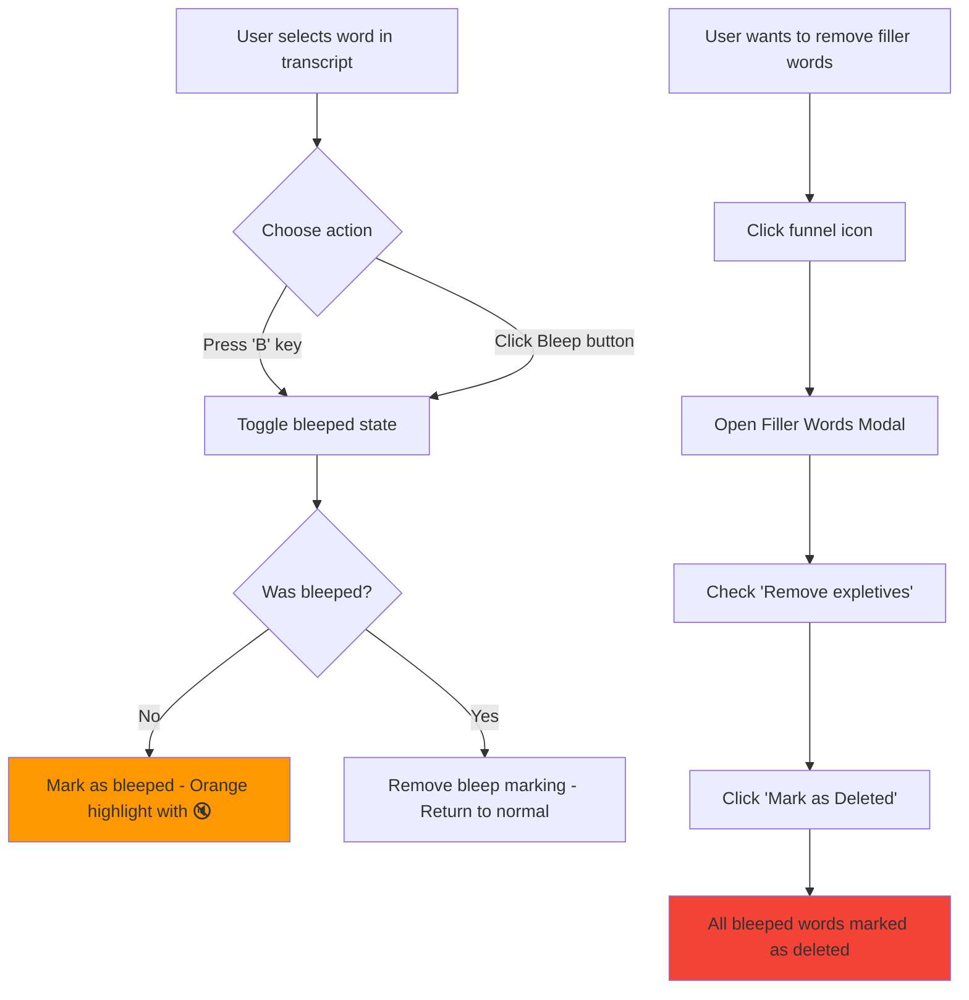

# Bleep Word Feature - Visual Guide

## UI Components

### Word States
```
Normal Word:     [word]
Deleted Word:    [w̶o̶r̶d̶]  (red, strikethrough, faded)
Bleeped Word:    [word]🔇 (orange, bold, bordered)
Inserted Word:   [word]  (green background)
```

### Edit Bar Buttons
```
┌─────────────────────────────────────────────────────┐
│ Edit ↵ | Del ⌫ | Bleep B | Cut ⌘X | Paste ⌘V | ... │
└─────────────────────────────────────────────────────┘
         └─ NEW BUTTON
```

### Filler Words Modal
```
┌───────────────────────────────────────────────┐
│  Remove Filler Words                      ×   │
├───────────────────────────────────────────────┤
│  [🔍 Search...]                               │
│                                               │
│  ☐ Remove silences greater than [0.4s ▼]     │
│  ☑ Remove expletives (bleeped words)          │  ← NEW OPTION
│     (5 bleeped words)                          │
│                                               │
│  Select All | Select None                     │
│                                               │
│  ☑ um (3)     ☑ uh (5)     ☑ like (8)        │
│  ☑ you know (2)  ☐ actually (1) ...          │
│                                               │
│  [+ Add custom word...]              [Add]    │
│                                               │
├───────────────────────────────────────────────┤
│  15 items • saves 12s → 1:23        [Cancel]  │
│                            [Mark as Deleted]  │
└───────────────────────────────────────────────┘
```

## User Flow Diagram



## Color Scheme

| State | Background | Border | Text | Icon |
|-------|-----------|--------|------|------|
| Normal | Transparent | None | White | - |
| Deleted | rgba(244,67,54,0.1) | None | #f44336 | - |
| **Bleeped** | **rgba(255,152,0,0.15)** | **1px solid rgba(255,152,0,0.3)** | **#ff9800** | **🔇** |
| Inserted | rgba(76,175,80,0.15) | None | #4CAF50 | - |
| Active | #2196F3 | None | White | - |

## Keyboard Shortcuts

| Key | Action |
|-----|--------|
| `B` | Toggle bleeped state on selected word(s) |
| `Del` / `⌫` | Toggle deleted state on selected word(s) |
| `Enter` / `↵` | Edit selected word |
| `⌘X` / `Ctrl+X` | Cut selected word(s) |
| `⌘V` / `Ctrl+V` | Paste cut word(s) |

## Code Structure

### 1. Type Definition (`types.ts`)
```typescript
export interface EditableWord {
  originalIndex: number;
  word: TranscriptWord;
  deleted: boolean;
  inserted?: boolean;
  bleeped?: boolean;  // ← NEW PROPERTY
}
```

### 2. Keyboard Handler (`TranscriptViewer.tsx`)
```typescript
// 'B' key - toggle bleeped state for selection or cursor word
else if (e.key === 'b' || e.key === 'B') {
  pushUndo();
  setEditedWords(prev => {
    const updated = [...prev];
    if (selection) {
      const anchorIndex = selectionAnchor ?? selection.start;
      const targetBleepedState = !prev[anchorIndex].bleeped;
      for (let i = selection.start; i <= selection.end; i++) {
        updated[i] = { ...updated[i], bleeped: targetBleepedState };
      }
    } else {
      updated[cursorIndex] = { 
        ...updated[cursorIndex], 
        bleeped: !updated[cursorIndex].bleeped 
      };
    }
    return updated;
  });
  setHasEdits(true);
  handled = true;
}
```

### 3. CSS Styling (`TranscriptViewer.scss`)
```scss
&__word {
  // ... existing styles
  
  &--bleeped {
    color: #ff9800;
    background: rgba(255, 152, 0, 0.15);
    border: 1px solid rgba(255, 152, 0, 0.3);
    font-weight: 600;
    position: relative;
    
    &::after {
      content: '🔇';
      position: absolute;
      top: -8px;
      right: -4px;
      font-size: 10px;
      opacity: 0.7;
    }
    
    &:hover {
      background: rgba(255, 152, 0, 0.25);
      border-color: rgba(255, 152, 0, 0.5);
    }
  }
}
```

### 4. Modal Integration (`TranscriptViewer.tsx`)
```typescript
// Updated props interface
interface FillerWordsModalProps {
  // ... existing props
  bleepedCount: number;
  bleepedDurationMs: number;
}

// Helper function
const getBleepedStats = useCallback((): { count: number; durationMs: number } => {
  let count = 0;
  let durationMs = 0;
  for (const ew of editedWords) {
    if (ew.deleted) continue;
    if (ew.bleeped) {
      count++;
      durationMs += ew.word.endMs - ew.word.startMs;
    }
  }
  return { count, durationMs };
}, [editedWords]);

// Updated handler
const handleRemoveFillers = useCallback((
  fillerWords: string[], 
  removeSilenceAbove: number | null,
  removeBleeped: boolean  // ← NEW PARAMETER
) => {
  const newEditedWords = editedWords.map(ew => {
    if (ew.deleted) return ew;
    
    // Check if it's a bleeped word that should be removed
    if (removeBleeped && ew.bleeped) {
      return { ...ew, deleted: true };
    }
    
    // ... rest of logic
  });
  // ...
}, [editedWords]);
```

## Implementation Checklist

- [x] Add `bleeped` property to `EditableWord` interface
- [x] Implement keyboard shortcut ('B' key)
- [x] Add "Bleep" button to edit bar
- [x] Create CSS styling for bleeped words
- [x] Add mute icon indicator
- [x] Update word rendering to show bleeped class
- [x] Add "Remove expletives" checkbox to Filler Words Modal
- [x] Implement bleeped word stats calculation
- [x] Update `handleRemoveFillers` to process bleeped words
- [x] Add CSS for modal checkbox option
- [x] Build and test client code

## Testing the Feature

1. **Mark a word as bleeped:**
   - Click on any word in transcript
   - Press 'B' key OR click "Bleep" button
   - Word should turn orange with mute icon

2. **Mark multiple words:**
   - Click first word
   - Shift+click last word to select range
   - Press 'B' key
   - All selected words become bleeped

3. **Remove bleeped words:**
   - Click funnel icon (Remove Filler Words)
   - Check "Remove expletives (bleeped words)"
   - Observe count of bleeped words
   - Click "Mark as Deleted"
   - All bleeped words should now be marked as deleted

4. **Undo/Redo:**
   - After marking words as bleeped
   - Click "Undo" button or press ⌘Z
   - Words should return to normal state
