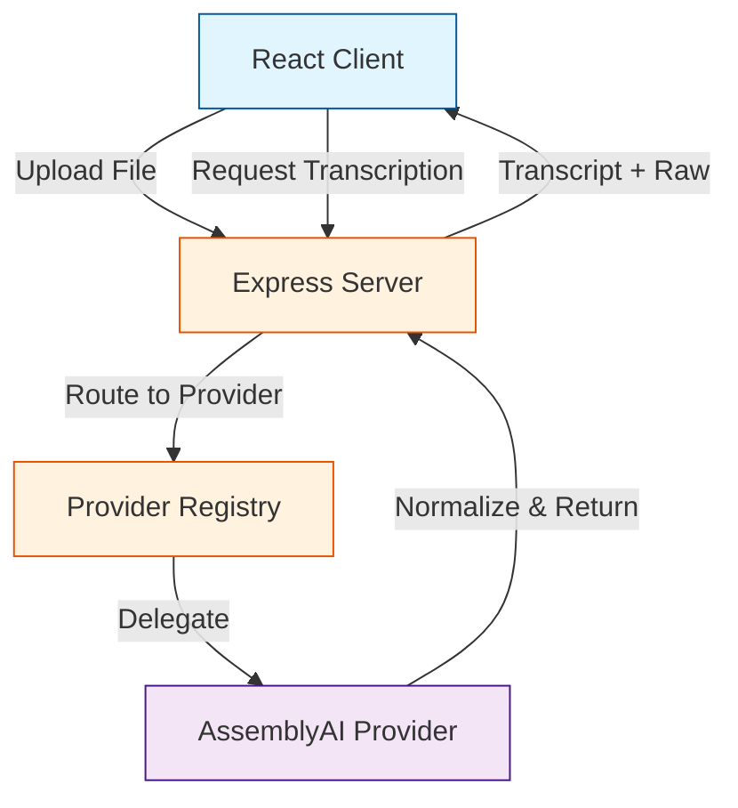

# Voice Transcription POC

A proof of concept demonstrating audio/video transcription with interactive word-level navigation using pluggable transcription backends.

## Features

- 🎙️ **Audio & Video Upload** - Drag and drop support for common formats (MP3, WAV, MP4, MOV)
- 🔌 **Pluggable Providers** - Provider-agnostic architecture (AssemblyAI implemented)
- 📝 **Word-Level Timestamps** - Precise timestamp tracking for every word
- 🎯 **Interactive Transcript** - Click any word to seek media playback
- 🔍 **Raw Data Access** - View original provider responses for debugging
- 🎨 **Normalized Schema** - Provider-agnostic transcript format for UI consistency

## Architecture



## Project Structure

```
voicepoc/
├── client/                 # React frontend
│   ├── src/
│   │   ├── components/    # UI components
│   │   │   ├── FileUpload.tsx
│   │   │   ├── MediaPlayer.tsx
│   │   │   └── TranscriptViewer.tsx
│   │   ├── App.tsx        # Main application
│   │   └── types.ts       # TypeScript types
│   └── package.json
├── server/                 # Express backend
│   ├── src/
│   │   ├── providers/     # Transcription providers
│   │   │   ├── assemblyai.ts
│   │   │   └── registry.ts
│   │   ├── types/         # TypeScript types
│   │   │   └── transcription.ts
│   │   └── index.ts       # Server entry point
│   └── package.json
└── package.json           # Workspace root
```

## Getting Started

### Prerequisites

- Node.js 18+ and npm
- AssemblyAI API key (get one at [assemblyai.com](https://www.assemblyai.com/))

### Installation

1. Clone the repository:
```bash
git clone <repository-url>
cd voicepoc-
```

2. Install dependencies:
```bash
npm install
```

3. Set up environment variables:
```bash
cd server
cp .env.example .env
# Edit .env and add your ASSEMBLYAI_API_KEY
```

4. Start the development servers:
```bash
# From the root directory
npm run dev
```

This will start:
- Server on http://localhost:3001
- Client on http://localhost:3000

### Usage

1. Open http://localhost:3000 in your browser
2. Drag and drop an audio or video file (or click to browse)
3. Select "AssemblyAI" from the provider dropdown
4. Click "Transcribe" and wait for processing
5. Click any word in the transcript to seek to that timestamp

## API Endpoints

### GET /api/providers
Returns list of available transcription providers.

**Response:**
```json
{
  "providers": [
    {
      "id": "assemblyai",
      "displayName": "AssemblyAI"
    }
  ]
}
```

### POST /api/upload
Upload a media file.

**Request:** multipart/form-data with `file` field

**Response:**
```json
{
  "success": true,
  "filename": "123456-audio.mp3",
  "url": "http://localhost:3001/uploads/123456-audio.mp3",
  "size": 1234567,
  "mimetype": "audio/mpeg"
}
```

### POST /api/transcribe
Transcribe media file using selected provider.

**Request:**
```json
{
  "mediaUrl": "http://localhost:3001/uploads/123456-audio.mp3",
  "providerId": "assemblyai",
  "options": {
    "speakerLabels": false
  }
}
```

**Response:**
```json
{
  "success": true,
  "provider": {
    "id": "assemblyai",
    "displayName": "AssemblyAI"
  },
  "transcript": {
    "durationMs": 120000,
    "words": [
      {
        "text": "Hello",
        "startMs": 100,
        "endMs": 500,
        "confidence": 0.95
      }
    ]
  },
  "raw": { /* Original provider response */ }
}
```

## Normalized Transcript Schema

The system uses a provider-agnostic schema:

```typescript
interface Transcript {
  durationMs: number;
  speakers?: Speaker[];
  words: TranscriptWord[];
  segments?: TranscriptSegment[];
}

interface TranscriptWord {
  text: string;
  startMs: number;
  endMs: number;
  speakerId?: string;
  confidence?: number;
}
```

## Adding New Providers

To add a new transcription provider:

1. Create a new provider class in `server/src/providers/`:

```typescript
import { TranscriptionProvider, ProviderResult } from '../types/transcription';

export class MyProvider implements TranscriptionProvider {
  id = 'my-provider';
  displayName = 'My Provider';
  
  async transcribe(mediaUrl: string, options?: any): Promise<ProviderResult> {
    // Call provider API
    const response = await callProviderAPI(mediaUrl);
    
    // Normalize to common schema
    const normalized = this.normalize(response);
    
    return {
      normalized,
      raw: response
    };
  }
  
  private normalize(response: any): Transcript {
    // Convert provider response to normalized schema
  }
}
```

2. Register the provider in `server/src/providers/registry.ts`:

```typescript
export function initializeProviders(): ProviderRegistry {
  const registry = new ProviderRegistry();
  
  // Register new provider
  const myProviderKey = process.env.MY_PROVIDER_API_KEY;
  if (myProviderKey) {
    registry.register(new MyProvider(myProviderKey));
  }
  
  return registry;
}
```

## Future Extensions

- Google Medical STT provider integration
- Speaker diarization visualization
- Word-level editing capabilities
- Server-side timestamp alignment verification
- Export to EDL/subtitle formats
- HIPAA-grade deployment with BAA-covered providers

## License

ISC

