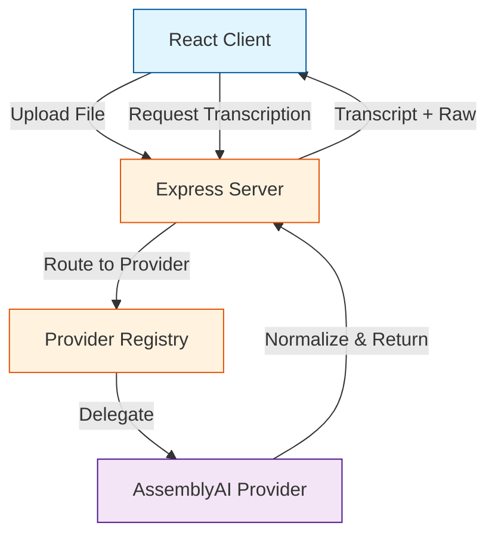
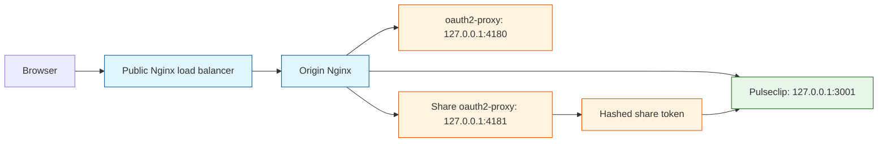

# Pulse Clip


> 📖 **[Implementation Details](IMPLEMENTATION.md)** | 🎯 **[The MIE Way](mie-pulse.md)**

## Features

- 🎙️ **Audio & Video Upload** - Drag and drop support for common formats (MP3, WAV, MP4, MOV)
- 🔌 **Pluggable Providers** - Provider-agnostic architecture (AssemblyAI cloud + local Whisper)
- 📝 **Word-Level Timestamps** - Precise timestamp tracking for every word
- 🎯 **Interactive Transcript** - Click any word to seek media playback
- 🔍 **Raw Data Access** - View original provider responses for debugging
- 🎨 **Normalized Schema** - Provider-agnostic transcript format for UI consistency

## Architecture


```mermaid
graph TB
    Client[React Client]
    Server[Express Server]
    Registry[Provider Registry]
    AI[AssemblyAI Provider]
    
    Client -->|Upload File| Server
    Client -->|Request Transcription| Server
    Server -->|Route to Provider| Registry
    Registry -->|Delegate| AI
    AI -->|Normalize & Return| Server
    Server -->|Transcript + Raw| Client
    
    classDef frontend fill:#e1f5ff,stroke:#01579b
    classDef backend fill:#fff3e0,stroke:#e65100
    classDef provider fill:#f3e5f5,stroke:#4a148c
    
    class Client frontend
    class Server,Registry backend
    class AI provider
```

## Project Structure

```
pulseclip/
├── client/                 # React frontend
│   ├── src/
│   │   ├── components/    # UI components
│   │   │   ├── FileUpload.tsx
│   │   │   ├── MediaPlayer.tsx
│   │   │   └── TranscriptViewer.tsx
│   │   ├── App.tsx        # Main application
│   │   └── types.ts       # TypeScript types
│   └── package.json
├── server/                 # Express backend
│   ├── src/
│   │   ├── providers/     # Transcription providers
│   │   │   ├── assemblyai.ts
│   │   │   └── registry.ts
│   │   ├── types/         # TypeScript types
│   │   │   └── transcription.ts
│   │   ├── cache.ts       # Transcription cache
│   │   ├── featured.ts    # Featured pulses management
│   │   └── index.ts       # Server entry point
│   ├── artipods/          # Artipod storage (gitignored)
│   │   └── {uuid}/        # Each artipod folder contains:
│   │       ├── media.ext      # Original media file
│   │       ├── thumbnail.png  # Thumbnail image
│   │       └── (future: transcript.json, beats.json, short.mp4)
│   ├── data/              # Persistent data
│   │   └── featured.json  # Featured pulses list
│   └── package.json
└── package.json           # Workspace root
```

## Getting Started

### Prerequisites

- Node.js 18+ and npm
- AssemblyAI API key (get one at [assemblyai.com](https://www.assemblyai.com/))

### Installation

1. Clone the repository:
```bash
git clone <repository-url>
cd voicepoc-
```

2. Install dependencies:
```bash
npm install
```

3. Set up environment variables:
```bash
cd server
cp .env.example .env
# Edit .env and add your ASSEMBLYAI_API_KEY
```

4. Start the development servers:
```bash
# From the root directory
npm run dev
```

This will start:
- Server on http://localhost:3001
- Client on http://localhost:3000

### Optional: local Whisper provider

Transcribe on your own hardware — free, offline, no API key. Requires
[whisper.cpp](https://github.com/ggml-org/whisper.cpp) and ffmpeg:

```bash
brew install whisper-cpp ffmpeg   # macOS; see whisper.cpp docs for Linux

# Download a model (base.en ~142MB is a good start; large-v3-turbo for quality)
mkdir -p server/models
curl -L -o server/models/ggml-base.en.bin \
  https://huggingface.co/ggerganov/whisper.cpp/resolve/main/ggml-base.en.bin
```

Then in `server/.env` (comma-separated paths each register as their own
provider, so the dropdown doubles as a model picker):

```bash
WHISPER_MODEL_PATH=./models/ggml-base.en.bin,./models/ggml-large-v3-turbo-q5_0.bin
```

Restart the server and "Whisper (base.en)" etc. appear in the provider dropdown.
Whisper transcriptions always run as background jobs (the UI polls for the
result), since local transcription is slower than a cloud API. Word timestamps
are alignment estimates — slightly softer boundaries than AssemblyAI's.

### Usage

1. Open http://localhost:3000 in your browser
2. Drag and drop an audio or video file (or click to browse)
3. Select "AssemblyAI" from the provider dropdown
4. Click "Transcribe" and wait for processing
5. Click any word in the transcript to seek to that timestamp

## Production Authentication and Sharing

Production traffic reaches Pulseclip through a public load balancer and the
origin Nginx instance. The Express process is intentionally bound to
`127.0.0.1:3001`; port `3001` must not be reachable from the network. This makes
origin Nginx the required authorization boundary for every application request.


```mermaid
flowchart LR
  Browser[Browser] --> LB[Public Nginx load balancer]
  LB --> Origin[Origin Nginx]
  Origin --> StandardOAuth[oauth2-proxy: 127.0.0.1:4180]
  Origin --> ShareOAuth[Share oauth2-proxy: 127.0.0.1:4181]
  Origin --> App[Pulseclip: 127.0.0.1:3001]
  ShareOAuth --> ShareToken[Hashed share token]
  ShareToken --> App

  classDef proxy fill:#e1f5ff,stroke:#01579b
  classDef auth fill:#fff3e0,stroke:#e65100
  classDef app fill:#e8f5e9,stroke:#1b5e20

  class LB,Origin proxy
  class StandardOAuth,ShareOAuth,ShareToken auth
  class App app
```

### Route Policy

| Route | Authentication policy | Destination |
| --- | --- | --- |
| `/oauth2/` | Public OAuth callback/sign-in flow | Standard oauth2-proxy on `4180` |
| `/oauth2-share/` | Public OAuth callback/sign-in flow | Share oauth2-proxy on `4181` |
| `/share/:token/...` | Share oauth2-proxy, then valid share token | Only the media and metadata mapped to that token |
| `/assets/`, `/login` | Public | Pulseclip application |
| `/`, `/api/`, `/artipod/`, `/artipods/` | Standard oauth2-proxy | Pulseclip application |

The standard oauth2-proxy permits only `mieweb.com` accounts. The share
oauth2-proxy permits any authenticated Google account, but it is only used for
`/share/` routes. The two services must retain their separate secure cookie
names: `__Host-teamsfetch` for standard access and
`__Host-teamsfetch-share` for shared content.

Share links are capability URLs, not general application access. A new share
receives a cryptographically random token; only its SHA-256 hash is persisted.
The server resolves `/share/:token/data` and `/share/:token/media` through that
registry before returning metadata or streaming a file. An unknown or revoked
token returns `404`. Share responses must remain `no-store`, private, and
unindexed.

### Origin Nginx Requirements

The origin virtual host proxies the application to `127.0.0.1:3001`, exposes
both local oauth2-proxy services only through their route prefixes, and applies
the route policy above with `auth_request`. Its server name must accept both the
origin hostname and `teamsfetch.mieweb.com` so the public host survives the LB
hop.

The OAuth configurations use these public callbacks:

```text
https://teamsfetch.mieweb.com/oauth2/callback
https://teamsfetch.mieweb.com/oauth2-share/callback
```

Both configurations require `reverse_proxy = true`, `cookie_secure = true`,
`set_xauthrequest = true`, and `whitelist_domains = ["teamsfetch.mieweb.com"]`.
Do not expose oauth2-proxy listeners `4180` or `4181` outside the host.

### Load Balancer Requirements

The LB terminates public TLS and forwards every route to the origin. It must not
run oauth2-proxy or use `auth_request`; those checks now belong exclusively to
origin Nginx. Do not cache authenticated application or share responses at the
LB.

Most importantly, the LB must preserve the public host while using the internal
origin name for TLS SNI:

```nginx
upstream teamsfetch_origin {
  server mie-phxdc-teamsfetch.med-web.com:443;
  keepalive 32;
}

location / {
  proxy_pass https://teamsfetch_origin;
  proxy_http_version 1.1;

  proxy_set_header Host $host;
  proxy_set_header X-Real-IP $remote_addr;
  proxy_set_header X-Forwarded-For $proxy_add_x_forwarded_for;
  proxy_set_header X-Forwarded-Proto $scheme;
  proxy_set_header X-Forwarded-Port $server_port;
  proxy_set_header X-Forwarded-Host $host;
  proxy_set_header Upgrade $http_upgrade;
  proxy_set_header Connection $connection_upgrade;

  proxy_ssl_server_name on;
  proxy_ssl_name mie-phxdc-teamsfetch.med-web.com;
}
```

The origin currently uses a locally generated TLS certificate. Until it is
replaced by a certificate trusted by the LB, the LB requires
`proxy_ssl_verify off`. Re-enable certificate verification as part of replacing
that origin certificate.

### Deployment Checks

Build the backend before restarting its process manager:

```bash
cd server
npm run build
```

The process manager must run `node dist/index.js` and keep it bound to loopback.
After deployment, validate the boundary from the origin host:

```bash
ss -ltn '( sport = :3001 )'
# Expected: 127.0.0.1:3001, never 0.0.0.0:3001 or [::]:3001.

curl --noproxy '*' http://127.0.0.1:3001/api/providers
# Expected: 200.

curl --noproxy '*' http://<origin-private-ip>:3001/api/providers
# Expected: connection refused.
```

With an unauthenticated browser session, requests through the public hostname
must redirect as follows:

```text
/api/              -> /login
/artipod/<id>      -> /login
/share/<token>     -> /oauth2-share/sign_in
```

## API Endpoints

### GET /api/providers
Returns list of available transcription providers.

**Response:**
```json
{
  "providers": [
    {
      "id": "assemblyai",
      "displayName": "AssemblyAI"
    }
  ]
}
```

### POST /api/upload
Upload a media file. Creates a new artipod with a UUID.

**Request:** multipart/form-data with `file` field

**Response:**
```json
{
  "success": true,
  "artipodId": "61dd3471-dd98-4ff3-a5ae-27afee3fc8af",
  "filename": "audio.mp3",
  "url": "/artipods/61dd3471-dd98-4ff3-a5ae-27afee3fc8af/audio.mp3",
  "size": 1234567,
  "mimetype": "audio/mpeg"
}
```

### GET /api/artipod/:artipodId
Get artipod info by UUID.

**Response:**
```json
{
  "success": true,
  "artipodId": "61dd3471-dd98-4ff3-a5ae-27afee3fc8af",
  "filename": "audio.mp3",
  "url": "/artipods/61dd3471-dd98-4ff3-a5ae-27afee3fc8af/audio.mp3",
  "size": 1234567,
  "thumbnail": "/artipods/61dd3471-dd98-4ff3-a5ae-27afee3fc8af/thumbnail.png"
}
```

### POST /api/transcribe
Transcribe media file using selected provider.

**Request:**
```json
{
  "mediaUrl": "/artipods/61dd3471-dd98-4ff3-a5ae-27afee3fc8af/audio.mp3",
  "providerId": "assemblyai",
  "options": {
    "speakerLabels": false
  }
}
```

**Response:**
```json
{
  "success": true,
  "provider": {
    "id": "assemblyai",
    "displayName": "AssemblyAI"
  },
  "transcript": {
    "durationMs": 120000,
    "words": [
      {
        "text": "Hello",
        "startMs": 100,
        "endMs": 500,
        "confidence": 0.95
      }
    ]
  },
  "raw": { /* Original provider response */ }
}
```

## Normalized Transcript Schema

The system uses a provider-agnostic schema:

```typescript
interface Transcript {
  durationMs: number;
  speakers?: Speaker[];
  words: TranscriptWord[];
  segments?: TranscriptSegment[];
}

interface TranscriptWord {
  text: string;
  startMs: number;
  endMs: number;
  speakerId?: string;
  confidence?: number;
}
```

## Adding New Providers

To add a new transcription provider:

1. Create a new provider class in `server/src/providers/`:

```typescript
import { TranscriptionProvider, ProviderResult } from '../types/transcription';

export class MyProvider implements TranscriptionProvider {
  id = 'my-provider';
  displayName = 'My Provider';
  
  async transcribe(mediaUrl: string, options?: any): Promise<ProviderResult> {
    // Call provider API
    const response = await callProviderAPI(mediaUrl);
    
    // Normalize to common schema
    const normalized = this.normalize(response);
    
    return {
      normalized,
      raw: response
    };
  }
  
  private normalize(response: any): Transcript {
    // Convert provider response to normalized schema
  }
}
```

2. Register the provider in `server/src/providers/registry.ts`:

```typescript
export function initializeProviders(): ProviderRegistry {
  const registry = new ProviderRegistry();
  
  // Register new provider
  const myProviderKey = process.env.MY_PROVIDER_API_KEY;
  if (myProviderKey) {
    registry.register(new MyProvider(myProviderKey));
  }
  
  return registry;
}
```

## Future Extensions

- Google Medical STT provider integration
- Speaker diarization visualization
- Word-level editing capabilities
- Server-side timestamp alignment verification
- Export to EDL/subtitle formats
- HIPAA-grade deployment with BAA-covered providers

## License

ISC

