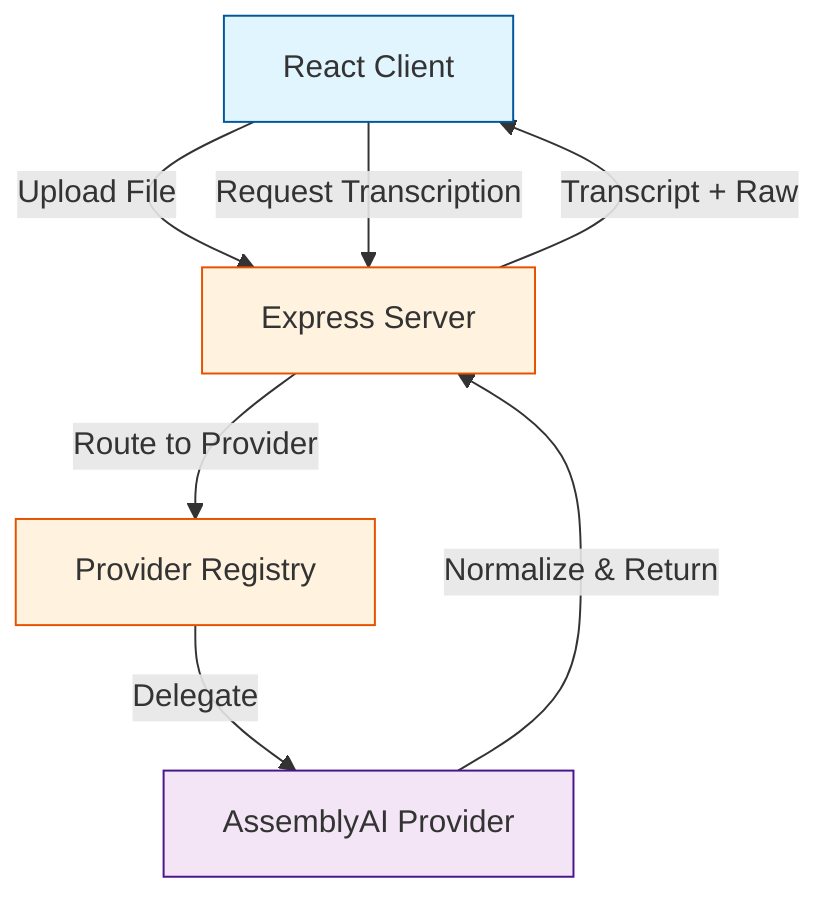

# Pulse Clip


> 📖 **[Implementation Details](IMPLEMENTATION.md)** | 🎯 **[The MIE Way](mie-pulse.md)**

## Features

- 🎙️ **Audio & Video Upload** - Drag and drop support for common formats (MP3, WAV, MP4, MOV)
- 📱 **Record on your phone** - Pair PulseCam by QR; the clip uploads straight into a pulse
- 🔌 **Pluggable Providers** - Provider-agnostic architecture (AssemblyAI cloud + local Whisper)
- 📝 **Word-Level Timestamps** - Precise timestamp tracking for every word
- 🎯 **Interactive Transcript** - Click any word to seek media playback
- ✂️ **Edit like a document** - Delete, cut, paste and reorder words; silent gaps become
  editable chips you can remove in one pass
- ⏩ **Re-time a passage** - Set a playback speed over a selection; the export bakes it in
- ✨ **AI editing** - Say what you want in plain English and the agent proposes it in the editor
  for you to review. It edits by operations (delete / move / speed) against the original word
  numbering, never auto-exports, and ⌘Z undoes the whole proposal. Bring your own LLM key, or
  use the server's if one is configured
- 🎤 **Dictate the instruction** - Speak it instead of typing; transcribed on-box by local Whisper
- 🕘 **Edit history** - Every AI run and hand edit on one timeline, with per-version diffs,
  rename, and undo/redo across versions
- 🎬 **Export** - Render the edited timeline to a new file, with optional burnt-in captions and
  a brand lower-third
- 🔍 **Raw Data Access** - View original provider responses for debugging
- 🎨 **Normalized Schema** - Provider-agnostic transcript format for UI consistency

## Architecture


```mermaid
graph TB
    Client[React Client]
    Server[Express Server]
    Registry[Provider Registry]
    AI[AssemblyAI Provider]
    
    Client -->|Upload File| Server
    Client -->|Request Transcription| Server
    Server -->|Route to Provider| Registry
    Registry -->|Delegate| AI
    AI -->|Normalize & Return| Server
    Server -->|Transcript + Raw| Client
    
    classDef frontend fill:#e1f5ff,stroke:#01579b
    classDef backend fill:#fff3e0,stroke:#e65100
    classDef provider fill:#f3e5f5,stroke:#4a148c
    
    class Client frontend
    class Server,Registry backend
    class AI provider
```

## Project Structure

```
pulseclip/
├── client/                 # React frontend
│   ├── src/
│   │   ├── components/    # UI components
│   │   │   ├── FileUpload.tsx
│   │   │   ├── MediaPlayer.tsx
│   │   │   └── TranscriptViewer.tsx
│   │   ├── App.tsx        # Main application
│   │   └── types.ts       # TypeScript types
│   └── package.json
├── server/                 # Express backend
│   ├── src/
│   │   ├── providers/     # Transcription providers
│   │   │   ├── assemblyai.ts
│   │   │   └── registry.ts
│   │   ├── types/         # TypeScript types
│   │   │   └── transcription.ts
│   │   ├── cache.ts       # Transcription cache
│   │   ├── featured.ts    # Featured pulses management
│   │   └── index.ts       # Server entry point
│   ├── artipods/          # Artipod storage (gitignored)
│   │   └── {uuid}/        # Each artipod folder contains:
│   │       ├── media.ext      # Original media file
│   │       ├── thumbnail.png  # Thumbnail image
│   │       └── (future: transcript.json, beats.json, short.mp4)
│   ├── data/              # Persistent data
│   │   └── featured.json  # Featured pulses list
│   └── package.json
└── package.json           # Workspace root
```

## Getting Started

### Prerequisites

- Node.js 18+ and npm
- AssemblyAI API key (get one at [assemblyai.com](https://www.assemblyai.com/))

### Installation

1. Clone the repository:
```bash
git clone <repository-url>
cd voicepoc-
```

2. Install dependencies:
```bash
npm install
```

3. Set up environment variables:
```bash
cd server
cp .env.example .env
# Edit .env and add your ASSEMBLYAI_API_KEY
```

4. Start the development servers:
```bash
# From the root directory
npm run dev
```

This will start:
- Server on http://localhost:3001
- Client on http://localhost:3000

### Optional: local Whisper provider

Transcribe on your own hardware — free, offline, no API key. Requires
[whisper.cpp](https://github.com/ggml-org/whisper.cpp) and ffmpeg:

```bash
brew install whisper-cpp ffmpeg   # macOS; see whisper.cpp docs for Linux

# Download a model (base.en ~142MB is a good start; large-v3-turbo for quality)
mkdir -p server/models
curl -L -o server/models/ggml-base.en.bin \
  https://huggingface.co/ggerganov/whisper.cpp/resolve/main/ggml-base.en.bin
```

Then in `server/.env` (comma-separated paths each register as their own
provider, so the dropdown doubles as a model picker):

```bash
WHISPER_MODEL_PATH=./models/ggml-base.en.bin,./models/ggml-large-v3-turbo-q5_0.bin
```

Restart the server and "Whisper (base.en)" etc. appear in the provider dropdown.
Whisper transcriptions always run as background jobs (the UI polls for the
result), since local transcription is slower than a cloud API. Word timestamps
are alignment estimates — slightly softer boundaries than AssemblyAI's.

### Usage

1. Open http://localhost:3000 in your browser
2. Drag and drop an audio or video file (or click to browse)
3. Select "AssemblyAI" from the provider dropdown
4. Click "Transcribe" and wait for processing
5. Click any word in the transcript to seek to that timestamp

## API Endpoints

### GET /api/providers
Returns list of available transcription providers.

**Response:**
```json
{
  "providers": [
    {
      "id": "assemblyai",
      "displayName": "AssemblyAI"
    }
  ]
}
```

### POST /api/dictate
Transcribe a short audio clip and return plain text. Backs the microphone in the AI-edit
composer, so an instruction can be spoken rather than typed.

Always the local Whisper provider — dictation is incidental to writing an instruction and should
not spend a deployment's paid transcription quota. Distinct from `/api/transcribe`, which works on
media already stored in an artipod and caches against that file: this takes a throwaway blob,
returns text, and keeps nothing. Capped at 10 MB.

**Request:** multipart/form-data with an `audio` field

**Response:**
```json
{
  "success": true,
  "text": "cut this down to about sixty seconds",
  "provider": { "id": "whisper", "displayName": "Whisper (base.en)" }
}
```

### POST /api/artipod/:artipodId/agent-edit
Ask the editorial agent for an edit; returns a job id to poll. The agent emits operations
(`delete` / `move` / `speed`) indexed against the ORIGINAL word numbering, which the server
resolves against a single snapshot — models are unreliable at renumbering after their own edits,
so they are never asked to. The result is written as a new checkpoint for a human to review in the
editor; nothing is exported automatically. Requires the app key when `SECRET_KEY` is set, since a
run spends money or a shared rate limit. Callers may supply their own provider config to spend
their own account instead.

### GET /api/artipod/:artipodId/edits
Editor state plus checkpoint metadata for the history timeline. Metadata only — an individual
version's diff is fetched on demand.

### POST /api/artipod/:artipodId/edits/restore
Move the history cursor to another checkpoint. Restoring never truncates, so stepping back and
forward is symmetric; only a new edit made while rewound abandons the versions ahead.

### POST /api/upload
Upload a media file. Creates a new artipod with a UUID.

**Request:** multipart/form-data with `file` field

**Response:**
```json
{
  "success": true,
  "artipodId": "61dd3471-dd98-4ff3-a5ae-27afee3fc8af",
  "filename": "audio.mp3",
  "url": "/artipods/61dd3471-dd98-4ff3-a5ae-27afee3fc8af/audio.mp3",
  "size": 1234567,
  "mimetype": "audio/mpeg"
}
```

### GET /api/artipod/:artipodId
Get artipod info by UUID.

**Response:**
```json
{
  "success": true,
  "artipodId": "61dd3471-dd98-4ff3-a5ae-27afee3fc8af",
  "filename": "audio.mp3",
  "url": "/artipods/61dd3471-dd98-4ff3-a5ae-27afee3fc8af/audio.mp3",
  "size": 1234567,
  "thumbnail": "/artipods/61dd3471-dd98-4ff3-a5ae-27afee3fc8af/thumbnail.png"
}
```

### POST /api/transcribe
Transcribe media file using selected provider.

**Request:**
```json
{
  "mediaUrl": "/artipods/61dd3471-dd98-4ff3-a5ae-27afee3fc8af/audio.mp3",
  "providerId": "assemblyai",
  "options": {
    "speakerLabels": false
  }
}
```

**Response:**
```json
{
  "success": true,
  "provider": {
    "id": "assemblyai",
    "displayName": "AssemblyAI"
  },
  "transcript": {
    "durationMs": 120000,
    "words": [
      {
        "text": "Hello",
        "startMs": 100,
        "endMs": 500,
        "confidence": 0.95
      }
    ]
  },
  "raw": { /* Original provider response */ }
}
```

## Normalized Transcript Schema

The system uses a provider-agnostic schema:

```typescript
interface Transcript {
  durationMs: number;
  speakers?: Speaker[];
  words: TranscriptWord[];
  segments?: TranscriptSegment[];
}

interface TranscriptWord {
  text: string;
  startMs: number;
  endMs: number;
  speakerId?: string;
  confidence?: number;
}
```

## Adding New Providers

To add a new transcription provider:

1. Create a new provider class in `server/src/providers/`:

```typescript
import { TranscriptionProvider, ProviderResult } from '../types/transcription';

export class MyProvider implements TranscriptionProvider {
  id = 'my-provider';
  displayName = 'My Provider';
  
  async transcribe(mediaUrl: string, options?: any): Promise<ProviderResult> {
    // Call provider API
    const response = await callProviderAPI(mediaUrl);
    
    // Normalize to common schema
    const normalized = this.normalize(response);
    
    return {
      normalized,
      raw: response
    };
  }
  
  private normalize(response: any): Transcript {
    // Convert provider response to normalized schema
  }
}
```

2. Register the provider in `server/src/providers/registry.ts`:

```typescript
export function initializeProviders(): ProviderRegistry {
  const registry = new ProviderRegistry();
  
  // Register new provider
  const myProviderKey = process.env.MY_PROVIDER_API_KEY;
  if (myProviderKey) {
    registry.register(new MyProvider(myProviderKey));
  }
  
  return registry;
}
```

## Future Extensions

- Google Medical STT provider integration
- Speaker diarization visualization
- Word-level editing capabilities
- Server-side timestamp alignment verification
- Export to EDL/subtitle formats
- HIPAA-grade deployment with BAA-covered providers

## License

ISC

