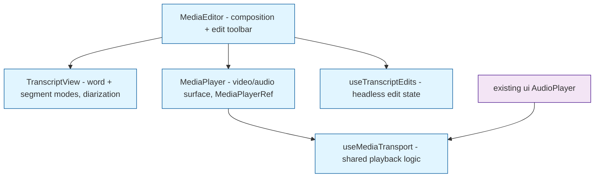

# Plan: PulseClip → `@mieweb/ui` MediaEditor Component

Goal: turn `client/` transcript-based editing into reusable `@mieweb/ui` components — developed and tested **here** in pulseclip, then lifted into [mieweb/ui](https://github.com/mieweb/ui) — we also want to review [mieweb/osheet](https://github.com/mieweb/osheet) since users like the `MediaPlayer` + transcript view there, and we want to make sure our new components can replace the existing osheet pattern.

## Reference UX: what users like in osheet (must not regress)

From `temp/osheet` `components/artifact-viewer.tsx` — these are acceptance criteria for the new components, not nice-to-haves:

- Segment rows: `timestamp | speaker | text`, click any row to seek + play
- Diarized speaker labels with friendly names (A→Clinician, B→Patient, C→Speaker 1…), consecutive same-speaker segments merged
- Waveform playback surface for audio (ui `AudioPlayer` waveform variant covers this)
- Transcript actions: copy to clipboard, re-transcribe, remove (action slots — the actions themselves stay host-app concerns)
- Raw data inspection: Text/YAML/JSON tabs (host-app concern in pulseclip today; keep supported via callbacks/slots)

## Target component decomposition

Design rules (all staged code):
- Tailwind + `cva` variants + semantic tokens only — no SCSS, no hardcoded colors
- Imperative refs (`MediaPlayerRef`: `seekTo`/`play`/`pause`/`getCurrentTime`/`getDuration`) — never leak raw DOM media elements
- Controlled & persistence-agnostic: `transcript`, `src`, `initialEdits`, `onEditsChange` props; no fetches
- Timestamps in **ms**; schema supports word-level AND segment-level with `speakerId` diarization
- ARIA labels + externalized user-facing strings
- No imports from pulseclip app code — staging folder must lift verbatim
- osheet UX parity (see Reference UX above) is a v1 requirement for `TranscriptView`, so osheet can swap in the new components with zero user-visible regression

---

## Milestone 1 — Wire `@mieweb/ui` into the client

- [x] Commit submodule setup (`.gitmodules`, `ui/`, `.gitignore` temp/)
- [x] Build the submodule: `cd ui && pnpm install && pnpm build`
- [x] Add `@mieweb/ui` dependency to `client/package.json` (`file:../ui`)
- [x] Add Tailwind to Vite client using ui's `tailwind-preset` (scoped so existing SCSS is untouched)
- [x] Wrap app in `ThemeProvider`; verify light/dark theme toggles work
- [x] Smoke test: render one `@mieweb/ui` component (e.g. `Button`) in the app

Notes (2026-07-16):
- Tailwind 4 via `@tailwindcss/vite`; `client/src/mieweb-ui.css` imports theme+utilities **without preflight** so existing SCSS is untouched; mieweb brand tokens via `@mieweb/ui/brands/mieweb.css`; `@source` scans ui dist (path is workspace-root `node_modules` — npm hoists).
- Import ui via subpath (`@mieweb/ui/components/*`) — the root export pulls DocumentScanner's 11MB ONNX wasm into the bundle.
- Smoke-tested in browser: `ThemeProvider` renders, `html.dark`/`data-theme` toggle works, `--mieweb-primary-500` token + `.bg-card`/`.border-border` utilities generated.

## Milestone 2 — Staging skeleton + shared types

- [x] Create `client/src/ui-staging/` mirroring ui's `src/components/` layout
- [x] Port transcript schema into `ui-staging/types/`: `Transcript`, `TranscriptWord`, `TranscriptSegment`, `Speaker`, `WordType`, `EditableWord`, `PlaybackSegment`
- [x] Reconcile schema for osheet needs: segment-level rendering + `speakerId`/`speakers[]` diarization (osheet uses seconds + `speaker` string — adapter is osheet's job, ms is canonical)
- [x] Repoint `client/src/types.ts` consumers to staging types (re-export shim OK)

Notes (2026-07-16): schema in `client/src/ui-staging/types/transcript.ts`; `client/src/types.ts` is now a re-export shim + app-only types (`Provider`, `TranscriptionResult`, `FeaturedPulse`). `ui-staging/README.md` documents the lift rules.

## Milestone 3 — `MediaPlayer`

- [x] `ui-staging/MediaPlayer/MediaPlayer.tsx`: video + audio surfaces, `cva` variants, tokens
- [x] `MediaPlayerRef` imperative handle (superset of ui's `AudioPlayerRef`)
- [x] Media-type detection by prop (`kind="video" | "audio"`) with extension-based fallback
- [x] Error state + retry (port from old client MediaPlayer) using ui `Button` + `role="alert"`
- [x] `onTimeUpdate`, `onStateChange`, `onEnded`, `onError` callbacks matching `AudioPlayer` API shape
- [x] Swap into `App.tsx` — raw element exposed only via transitional `mediaElementRef` prop (full removal blocked on `TranscriptViewer`, lands with M4/M5)
- [x] Delete old `MediaPlayer.tsx` + `MediaPlayer.scss`
- [x] Manual test: video artipod + audio artipod both play, seek, error-retry

Notes (2026-07-16):
- `MediaPlayerRef` is ms-based (`seekToMs`/`getCurrentTimeMs`/…) + `setPlaybackRate`, `isPaused`, `mediaElement` escape hatch.
- Fixed react types conflict (ui submodule pulls `@types/react@19`): client tsconfig `paths` pins `react`/`react-dom` types to the workspace copy; bumped client `@types/react` to 18.3.x.
- Added `/artipods` to the vite dev proxy (was missing; only `/api` + `/uploads` were proxied).
- Dev env quirk: `server/.env` doesn't exist, server defaults to port 3000 and collides with vite — run with `PORT=3001`. Seeded `server/artipods/test-{video,audio}-0001/` for manual testing.

## Milestone 4 — `TranscriptView` (read-only)

- [x] Extract read-only rendering from `TranscriptViewer.tsx` into `ui-staging/TranscriptView/`
- [x] Word-level mode: click-to-seek, current-word highlight follow, silence rendering
- [x] Segment-level mode (osheet parity): timestamp + speaker + text rows, click-to-seek + play
- [x] Same-speaker segment merging (osheet `formatTranscriptText` behavior) as a display option
- [x] Diarization: `speakers` prop with display names; `speakerLabels` mapping / render prop (Clinician/Patient etc.)
- [x] Toolbar/action slot so hosts can add copy / re-transcribe / remove buttons (osheet pattern)
- [ ] Playback speed control + speed markers → deferred to M5 (`SpeedMarker` depends on `EditableWord` state)
- [x] Tokens/cva styling; ARIA (`aria-current`, keyboard nav, list semantics)
- [ ] Swap into pulseclip → happens in M5 (the app has no pure non-editing path; `TranscriptViewer` couples viewing+editing, so the swap lands when `MediaEditor` replaces it)

Notes (2026-07-16): component is controlled — `currentTimeMs` in, `onSeek(timeMs)` out; no media coupling at all. `granularity` auto-resolves (segments → segment mode). Auto-scroll suppressed while hovering.

## Milestone 5 — `useTranscriptEdits` + `MediaEditor`

- [ ] `ui-staging/hooks/useTranscriptEdits.ts`: `EditableWord[]` state, delete/cut/copy/paste, undo stack, `PlaybackSegment` derivation, filler/silence match computation
- [ ] `FillerWordsModal` rebuilt on ui `Modal`, `Checkbox`, `Input`, `Slider`, `Button`
- [ ] `MediaEditor` composition: `MediaPlayer` + editable `TranscriptView` + toolbar; edited-timeline playback via segments
- [ ] v1 scope: word-mode editing only (segment-mode editing deferred to Milestone 8; segment mode remains read-only in `TranscriptView`)
- [ ] Controlled API: `initialEdits`, `onEditsChange(editedWords, undoStack)`, `onCursorTimestampChange`
- [ ] Swap into `App.tsx`; keep YAML/JSON raw-data debug view in pulseclip (feeds from `MediaEditor` state via callbacks)
- [ ] Delete `TranscriptViewer.tsx` (2,301 lines) + SCSS once fully replaced
- [ ] Full regression pass: edit, undo, cut/paste, filler removal, silence removal, edited playback, persistence round-trip

# Stop Here — the next milestones are for `@mieweb/ui` PRs, not pulseclip app code

## Milestone 6 — Lift into mieweb/ui (PRs)

- [ ] ui PR A: extract `useMediaTransport` from `AudioPlayer` (no API change) — reconcile staged `MediaPlayer` transport onto it
- [ ] ui PR B: copy `ui-staging/*` → `ui/src/components/*`; add `index.ts` exports, Storybook stories, vitest tests
- [ ] Dark-mode + theme audit in Storybook
- [ ] pulseclip PR: flip imports from `ui-staging/` to `@mieweb/ui`, delete staging folder, pin ui version
- [ ] Decide submodule fate: keep for dev or drop in favor of published package

## Milestone 7 — Segment-mode (diarization) editing

v1 `MediaEditor` edits word-mode transcripts only; segment-mode stays read-only in `TranscriptView`. This milestone brings editing to diarized, segment-level transcripts (the osheet shape).

- [ ] Extend `useTranscriptEdits` to operate on segments (delete/reorder segments, undo stack, `PlaybackSegment` derivation from segments)
- [ ] Speaker-aware editing: reassign speaker on a segment, rename speakers
- [ ] Segment-mode editing UI in `MediaEditor` (row-level selection/toolbar)
- [ ] Filler/silence removal semantics for segment granularity (or graceful degradation when word timestamps are absent)
- [ ] osheet follow-up PR: enable editing in `artifact-viewer.tsx`
